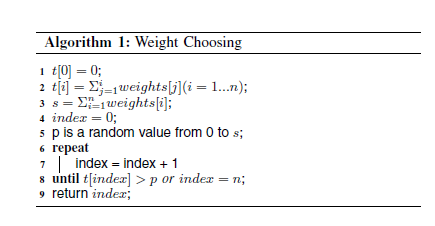
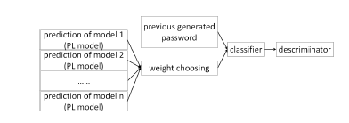

# GENPass阅读笔记

《GENPass：A General Deep Learning Model for Password Guessing with PCFG Rules and Adversarial  Generation》

会议：[2018 IEEE International Conference on Communications (ICC)](https://ieeexplore.ieee.org/xpl/conhome/8411665/proceeding)

发表年份：20-24 May 2018

## 1. 引言

​		背景：HashCat和JtR是非常有价值的口令猜测工具，但是却只能破解有限的口令。马尔可夫和上下文无关文法模型都是概率模型，他们广泛应用于口令猜测领域。但是概率模型需要相对比较长的运行时间以及空间。Melicher等人率先提出基于神经网络的口令猜测方法。Hitaj等人基于GAN对抗生成神经网络提出PassGAN用于口令猜测。然而，两者的工作都集中单站点攻击，这意味着他们的方法泛化能力有所缺失。

​		贡献：提出新的机器学习口令猜测方法GENPass。GENPass的生成器为PCFG+LSTM（简称为PL）。PL是LSTM和PCFG两者优点的折中，它利用PCFG的标签对口令进行标记，并用于LSTM训练和生成。模型的泛化能力是指模型产生的口令在其他数据集中也有很高的命中率。GENPass拥有很强的泛化能力，因为模型拥有多个生成器。主要贡献包括：

+ PL能够提升LSTM在单站点和跨站点攻击的猜测能力。
+ GENPass能够从泄露的口令学习并产生更加通用的口令。通用意味着在跨站攻击中具有很高的命中概率。

## 2. 相关工作

### 2.1 传统口令猜测方法

+ Hashcat和John the Ripper
+ 马尔可夫模型
+ PCFG模型

### 2.2 神经网络的口令猜测方法

+ LSTM
+ PassGAN

## 3. 模型

### 3.1 PCFG+LSTM（PL）

Motivation：PCFG模型将口令按照字符种类分为多个单元（unit）。由于用户选择口令时通常带有语义，因此PCFG拥有很高的猜测命中率。传统的LSTM根据给定字符串每次生成后一个字符。如果将两者结合将产生更加有效率的口令猜测方法。

1）预处理

口令被编码为单元的序列。每个单元对应PCFG的段，包括字母L，数字D，特殊字符S和结尾符N。同时后面跟一个数字代表字符数量。

2）生成

将预处理的数据作为输出训练LSTM模型，并让模型产生后一个单元（PCFG的段）。

3）口令猜测

LSTM产生预测单元（段）后，每一种单元都对应一系列PCFG的段。只需要从候选的口令分段中随机选择口令分段就能生成真正的口令。随机选取口令分段的过程称为权重选择（weight choosing）。

4）权重选择

权重选择就是从多个口令分段中选取一个分段。简单的想法是直接选取频率最高的分段，但是这种方法存在弊端（产生很多重复口令）。权重选择将所有口令分段的频率看成一个整体P，每个分段的概率为p_i/P。这样就能产生符合分段分布的分段数据。算法如下：

### 3.2 GENPass

GENPass的目标为从不同的数据集中生成通用的口令。解决的问题是，简单地将来自不同数据集的口令组合无法得到通用的规则或者规律。

1）n个预测模型

预测模型就是之前提到的PL，这里将独立训练的n个PL模型作为生成器。

2）权重选择

和之前提到的过程一致。

3）分类器

GENPass的分类器就是从生成的口令集中训练的卷积神经网络分类器。分类的结果是长度为n的向量。分类器最终通过SoftMax层保证向量的和为1，向量的每一个值表示数据来源于该PL模型（也就是相应的数据集）的可能性。

4）判别器

判别器用于判断数据是否应该被采纳。采纳的标准是分类器产生数据的标准差。标准差越大意味着口令越不通用，标准差越小意味着口令越常见（general）。

### 3.3 带概率的GENPass

​		之前的GENPass模型假设所有PL模型的选择概率是一样的。然而在真实场景中并不是所有口令集的泛化性都一致。因此需要在GENPass模型中引入每个口令集的特点用于衡量口令集对模型最终泛化能力的影响。

1）带概率的权重选择

在之前的权重选择的基础上添加数据集的概率。这里假设数据集的概率分布P代表每一个数据集的权重，并且p_i的和为1。根据贝叶斯公式，经过这个过程后权重选择的总概率为1.

2）带概率的判别器

标准差不能描述多个分布之间的差异，这里引入了Kullback-Leibler divergence(KL divergence) 用于计算产生口令的在不同数据集下可能性的差异。

## 4. 实验

1）实验数据

MySpace，phpBB，RockYou，LinkedIn

2）训练和测试方法

主要分为同站猜测和跨站猜测。猜测目标数据只选取所有数据的10%。GENPass由MySpace和phpBB数据集训练。

3）评估

+ PL在同站和跨站的猜测场景下均优于LSTM模型。在同站的猜测场景下，PL在10^7就能猜测55%-65%的口令，超越LSTM的5%-10%。在跨站场景下，PL和LSTM猜测能力均有所下滑，但是PL能够超越LSTM16%-30%。
+ GENPass在有多个数据集作为训练集的场景下超过单个训练集的PL和LSTM。
+ GENPass的猜测能力超过直接训练组合数据集的PL，证明GENPass能够有效提升口令集组合猜测能力。